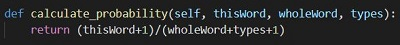

Goal of this part is to compute the probability of a sentence or sequence of words and so the language model used in this part is ngram.
For each ngram (unigram, biagram, trigram) there are list of words which cover each of them and follows the formula shown below for their probability:



There are two .py files in this folder :
LanguageModelUNK.py
LanguageModel.py

The first file calculates the probabilities with UNK words means that some of words have been marked as UNK words, It helps us in perplexity part.
The second file calculates the probabilities of original words of train data, It helps us in text generation.

To run each file follow the below path:

######  NLP97982\P2\Model\src

and run each .py file using:

```
python LanguageModel.py
```
or
```
python LanguageModelUNK.py
```