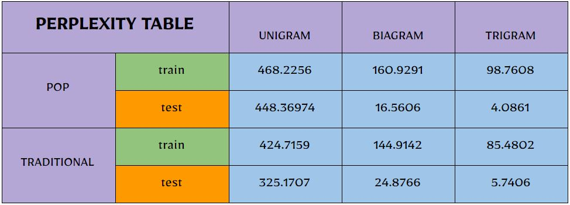

We know that a better model of a text is one which assigns a higher probability to the word that actually occurs and 
perplexity is the inverse probability of the test set, normalized by the number of words and 
is one which assigns a higher probability to the word that actually occurs so:

###Minimizing perplexity is the same as maximizing probability

As you see in the table above perplexity decreases as we increase number of n in ngram and the perplexity should be lower in train than text 
but because we have splitted data of test and train in proportion of 80/20 so words in train are much more than words in test and perplexity
has become more in train.