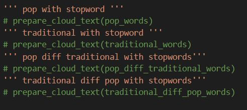
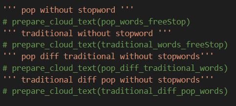

###This project is for my NLP course and the subject is recognizing pop and traditional lyrics:

The procedure of implementing each part is in folders and if you refer them you can completely understand what I have done for them and 
how each part works.

#To run:
If you want to run first of all you need to install the dependencies
Open your command line in windows and type each of the lines one by one:
```python
pip install hazm
pip install wordcloud
pip install matplotlib
pip install arabic_reshaper
pip install bidi
```

Now you can run my project in the way below:
```python
python processing.py
```
This part just normalizes and tokenizes the lyrics.

Then:
```python
python wordcloud.py
```
This part uses from processed data and creates the word cloud.

**Pay attention**
As my this project cancreate 8 wordclouds there are 8 commented lines in WordCloud/src/wordcloud.py, to see the wordcloud of any of them please uncomment it before running wordcloud.py
Commented parts are :



and

