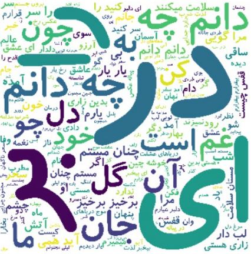
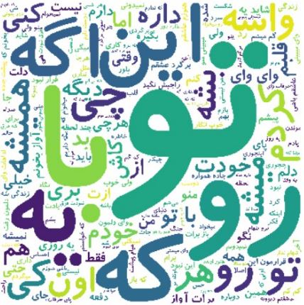
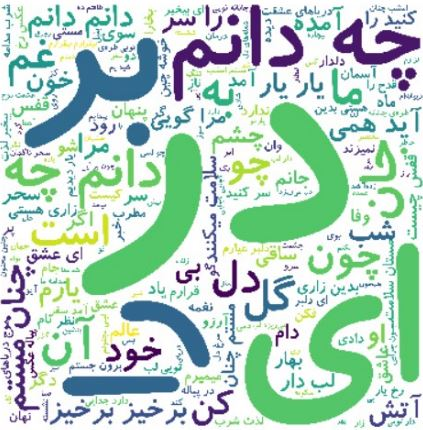
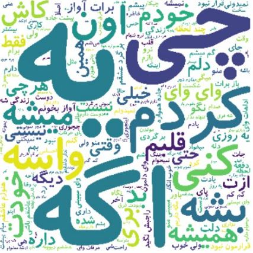
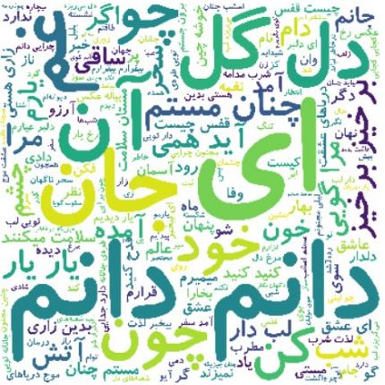
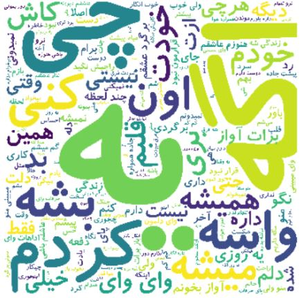
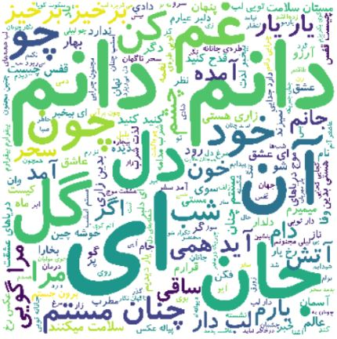

##WordCloud
Word clouds (also known as text clouds or tag clouds) work in a simple way: the more a specific word appears in a source of textual data (such as a speech, blog post, or database), the bigger and bolder it appears in the word cloud.

First of all the data which was processed in data processing has been read in this part.
Then the wordcloud module has been used to create the wordcloud of texts.

**WordClouds analysis**

###1.pop:

######analysing:
The words "تو", "با", "که", "رو" and ... are larger than others
that means the frequency of these words in pop text is more than other words
and the words "بمونه", "نمیدونم", "صدام" and ... are smaller than others and also it means
the frequency of them in pop text is not too much.

----------------------------------------------------------------------------------------------------

###2.traditional:

######analysing:
The words "در", "را", "بر, "ای"  and ... are larger than others
that means the frequency of these words in traditional text is more than other words
and the words "کجایی", "سرو", "ابر" and ... are smaller than others and also it means
the frequency of them in pop text is not too much.

----------------------------------------------------------------------------------------------------

###3.pop diff traditional:

######analysing:
If we get diff between pop and traditional text (all the words minus the words that are in both of them) some word's frequency 
becomes smaller but others like "تو " stay the same as before it means that we have "تو" in pop text alot but it is not repeated
too much in traditional text.

----------------------------------------------------------------------------------------------------

###2.traditional diff pop:

######analysing:
If we get diff between pop and traditional text (all the words minus the words that are in both of them) some word's frequency 
becomes smaller but others like "در", "ای" stay the same as before it means that we have "در", "ای" in traditional text alot but they are not repeated
too much in pop text.

----------------------------------------------------------------------------------------------------

***Analyze the first four wordclouds***
As you see in the first four wordclouds most of the words are "در", "با", "به"... which we call them stopwords and if we do not remove them
the may cause problem because they do not have special meaning and the appear in both text.So stopwords make recognition difficult.
now, stopwords are removed and the results are shown below:
----------------------------------------------------------------------------------------------------

###5.pop without stopwords:

######analysing:
The words "قلبم", "اون", "یه", "اگه"  and ... are larger than others
that means the frequency of these words now have been more in pop text
and the words "قلب", "خودت", "میگی" and ... are smaller than others and also it means
the frequency of them have been less in pop text.

----------------------------------------------------------------------------------------------------

###6.traditional without stopwords:

######analysing:
The words "دانم", "ای", "جان", "دل"  and ... are larger than others
that means the frequency of these words now have been more in pop text
and the words "دلبر", "دیدم", "خاطر" and ... are smaller than others and also it means
the frequency of them have been less in pop text.

----------------------------------------------------------------------------------------------------

###7.pop diff traditional without stopwords:

######analysing:
If we get diff between pop and traditional text (all the words minus the words that are in both of them) some word's frequency 
becomes smaller but others like "یه " stay the same as before it means that we have "یه" in pop text alot but it is not repeated
too much in traditional text.

----------------------------------------------------------------------------------------------------

###8.traditional diff pop without stopwords:

######analysing:
If we get diff between traditional and pop text (all the words minus the words that are in both of them) some word's frequency 
becomes smaller but others like "دانم", "دل", "گل" stay the same as before it means that we have "دانم", "دل", "گل" in traditional text alot but they are not repeated
too much in pop text.

----------------------------------------------------------------------------------------------------

***Analyze the second four wordclouds***
As you see in the second four wordclouds most of the words now help us more in recognition between pop and traditional lyrics.
Forexample words in pop lyrics are more informal and words in tradional lyrics are more formal.
----------------------------------------------------------------------------------------------------